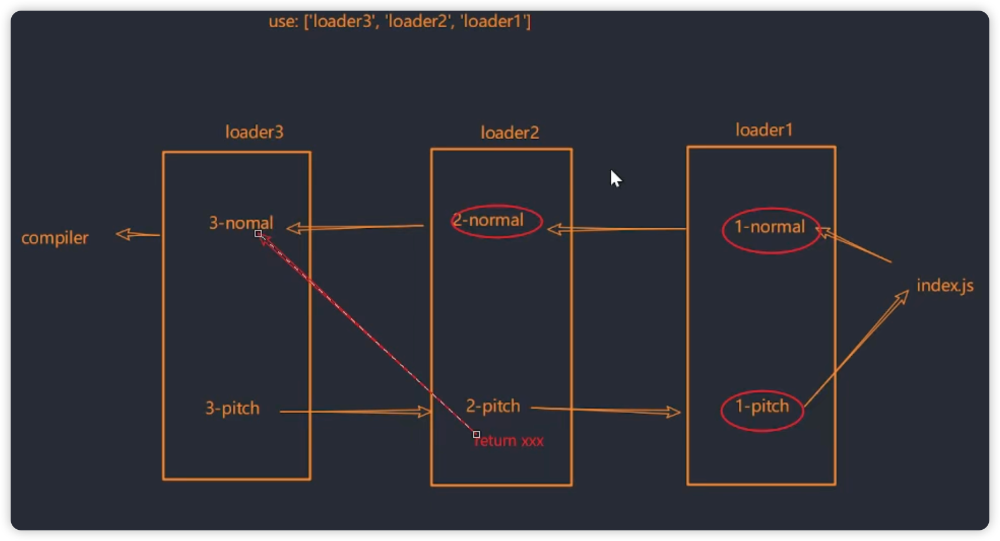

# Loader使用
1. loader 本质上就是一个导出内容为函数的JS模块。
2. Loader 默认就可以接收上游传递过来的资源文件或者结果
3. compiler会拿到最后一个 loader 的产出结果，这个结果应该是
   string 或者 buffer
4. 从入口文件出发，找到所有依赖的模块，直到所有依赖模块也都被 Loader 处理之后返回结果

    file-loader 处理图片的时候是怎么做？
- 返回一个字符串形式的图片名称（路径）
- 资源拷贝一份到指定目录
  拼 Loader 分类

> 对于 loader 默认都是一样的，只不过在使用的时候可以放在不同的位置或者进行了不同的
修饰， 因此说清起来 Loader 就有分类了

1. 普通Loader： 没有做任何的配置
2. 前置Loader: enforce 属性配置 pre
3. 后置loader: enforce 属性配置 post
4. 行内Loader：使用！进行分割

# loader执行顺序
1. 默认的是从后往前执行
2. pre - normal - inline - post

# loaderRunner

# loader配置符号的使用
> 为了使用方便
- !跳过了normal loader
- -!跳过了normal 和 pre loader跳过了
- !!跳过了normal pre post 只保留了inline loader

# loader的组成
> 一个完整的loader是由normalLoader pitchLoader

# loader获取配置参数

# loader参数校验

# file-loader
> 用于处理文件（如图片、字体等资源），并将它们复制到输出目录，同时返回文件的路径。